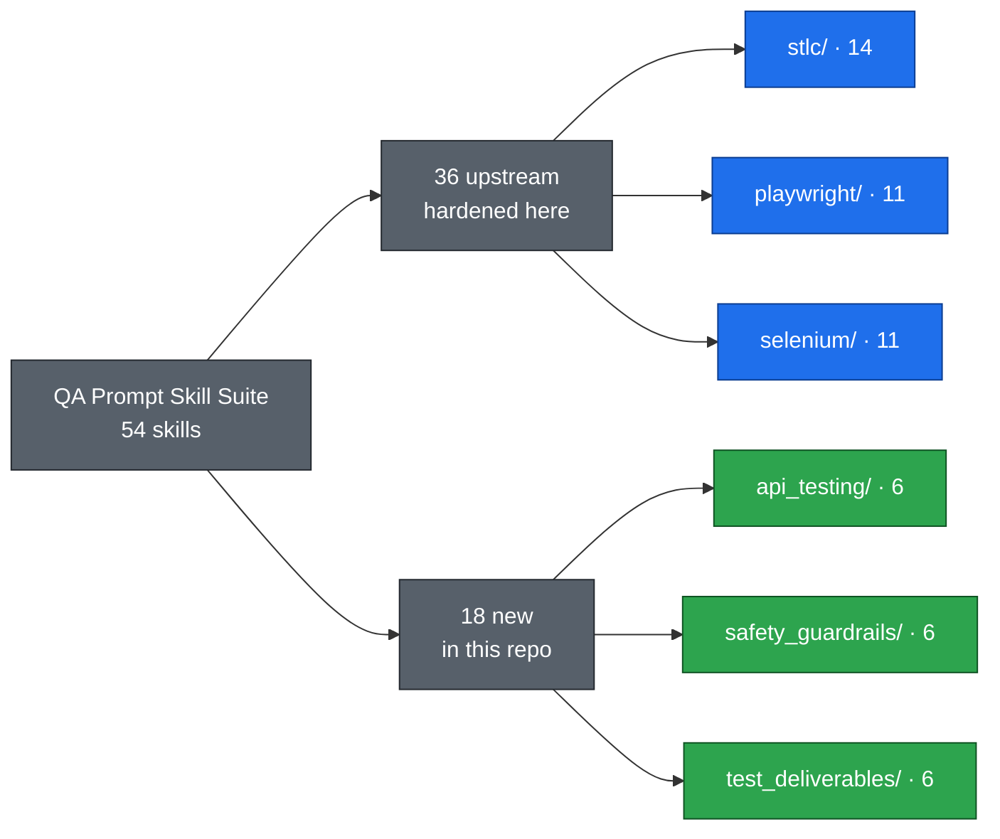
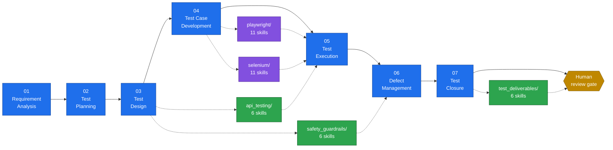
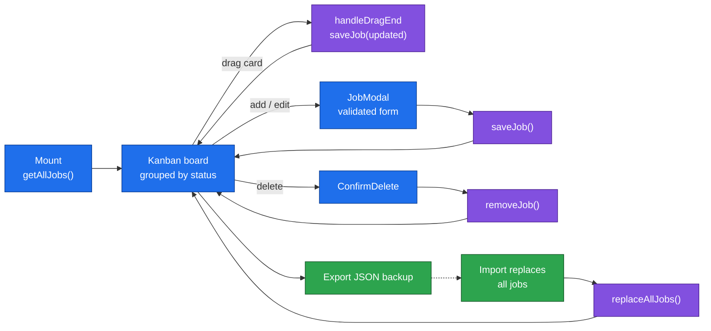

# AITester Blueprint 4x

AI-powered test automation blueprint.

## Contents

- [Overview](#overview)
- [Chapters](#chapters)
  - [Chapter 01: LLM Basics](#chapter-01-llm-basics)
  - [Chapter 02: Prompt Engineering](#chapter-02-prompt-engineering)
    - [The 54-skill QA prompt suite](#the-54-skill-qa-prompt-suite)
    - [Install a skill](#install-a-skill)
  - [Chapter 03: Local Test Case Generator](#chapter-03-local-test-case-generator)
    - [Features](#features)
    - [File structure](#file-structure)
    - [Running the app](#running-the-app)
    - [Environment variables](#environment-variables)
    - [Data flow](#data-flow)
  - [Chapter 04: JobKit AI](#chapter-04-jobkit-ai)
  - [Chapter 05: Job Tracker AI](#chapter-05-job-tracker-ai)
    - [Features](#features-1)
    - [Tech stack](#tech-stack)
    - [Data model](#data-model)
    - [Running the app](#running-the-app-1)
    - [State flow](#state-flow)
  - [Chapter 06: Branding and LinkedIn Skills](#chapter-06-branding-and-linkedin-skills)
- [License](#license)

## Overview

AITester Blueprint 4x Where we will learn about a lot of things related to:
- AI Agent
- MCPs
- RAG
- LLM evaluations
- Langchain
- Langflow
- ATAN
- and many more things which will make us the AI-powered tester

## Chapters

### Chapter 01: LLM Basics
Foundation concepts of Large Language Models and AI fundamentals.

### Chapter 02: Prompt Engineering

RICE-POT template framework for structured prompt engineering, a Salesforce Selenium test
framework built with the Page Object Model pattern, and a
[54-skill QA prompt suite](chapter_02_Prompt_Eng/prompt_templates/README.md).

#### The 54-skill QA prompt suite

Every skill is a folder holding a `SKILL.md` with YAML frontmatter, so it drops straight into
`~/.claude/skills/` or `~/.codex/skills/` and is invoked by name. 36 skills come from
[skillmasterclass](https://github.com/PramodDutta/skillmasterclass/tree/d8c5108d5ae524b10a5a1c695cdee8cfc018be7b/skillmasterclass/skills)
and are hardened here for credential handling, execution authorization, network isolation, and
evidence redaction. 18 are new: API testing, AI safety and guardrails, and test deliverables.



Where each group plugs into the lifecycle:



Nothing in the suite is self-approving. Skills report only what the supplied evidence supports,
mark anything unverified as unknown rather than assuming it passed, and stop at a human review
gate before a plan, case set, defect, report, or release decision counts as final.

<details>
<summary><b>STLC · 14 skills</b>: requirement analysis through test closure</summary>

| Skill | What it does |
| --- | --- |
| `jira-requirement-analyzer` | Score a JIRA ticket against a readiness checklist, return gaps, ambiguities, risks, and clarifying questions |
| `test-plan-generator` | Fetch a ticket and fill the standard test plan template, stopping for human review |
| `test-scenario-designer` | Derive positive, negative, boundary, and cross-role scenarios traced to each acceptance criterion |
| `api-test-designer` | Map endpoint or contract coverage across happy path, schema, auth, negative, boundary, and idempotency |
| `test-case-writer` | Expand approved scenarios into preconditions, ordered steps, expected results, and required data |
| `test-data-generator` | Produce labeled valid, invalid, boundary, and synthetic data sets per field or scenario |
| `automation-script-generator` | Framework-neutral handoff for an approved case, plus a Playwright versus Selenium stack decision |
| `test-execution-tracker` | Record pass, fail, blocked, or not-run per case with evidence, then roll up cycle progress |
| `regression-suite-selector` | Map a change to the tests that exercise it and rank a risk-based run set |
| `bug-reporter` | Turn an observed failure into a structured, reproducible defect report |
| `bug-triage-assistant` | Group likely duplicates, propose severity and priority, and route a defect backlog |
| `rca-analyzer` | Run 5-Whys plus fishbone to separate root cause from symptom and propose corrective actions |
| `test-coverage-analyzer` | Build a traceability view and surface untested ACs, thin areas, and orphan tests |
| `test-closure-reporter` | Roll cycle metrics into highlights, risks, and an advisory go or no-go |

</details>

<details>
<summary><b>Playwright · 11 skills</b>: TypeScript automation pack</summary>

| Skill | What it does |
| --- | --- |
| `pw-test-generator` | Generate a TypeScript spec from an approved, detailed test case |
| `pw-page-object-builder` | Build a POM class with `getByRole` / `getByTestId` locators, action methods, and a static `PATH` |
| `pw-locator-fixer` | Rewrite brittle XPath, CSS class, and nth-child selectors into resilient ones with a before and after map |
| `pw-fixture-designer` | Design typed auth, seeded-data, and page-object fixtures with correct scope and teardown |
| `pw-network-mocker` | Stub responses and error states via `page.route` to remove backend flakiness |
| `pw-api-tester` | Cover an endpoint through the request context: happy path, schema, auth, negative, boundary |
| `pw-visual-regression` | Set up `toHaveScreenshot` with masking, thresholds, and a baseline strategy |
| `pw-accessibility-auditor` | Wire `@axe-core/playwright` checks and triage violations against a supplied policy |
| `pw-trace-analyzer` | Read a `trace.zip` timeline to isolate the failing action and recommend the fix |
| `pw-flaky-debugger` | Root-cause races, hard waits, and shared state, then propose deterministic fixes |
| `pw-ci-configurator` | Generate a GitHub Actions workflow with sharding, blob and HTML reports, and artifacts |

</details>

<details>
<summary><b>Selenium · 11 skills</b>: Java, TestNG, Maven automation pack</summary>

| Skill | What it does |
| --- | --- |
| `se-test-generator` | Generate a Selenium 4 plus TestNG Java test from an approved case using explicit waits |
| `se-page-object-builder` | Build a Java POM class with `@FindBy` or explicit locators plus `WebDriverWait` |
| `se-locator-strategist` | Replace brittle absolute XPath with `By.id`, CSS, or Selenium 4 relative locators |
| `se-wait-fixer` | Remove `Thread.sleep` and implicit-explicit wait mixing in favor of `WebDriverWait` or `FluentWait` |
| `se-driver-manager` | Set up Selenium Manager or WebDriverManager with browser options and a thread-safe factory |
| `se-framework-scaffolder` | Scaffold a Maven plus TestNG project: base test, POM package, config loader, logging, reporting |
| `se-data-driven-designer` | Design `@DataProvider` or Excel, CSV, JSON driven tests across valid, invalid, and boundary sets |
| `se-cross-browser-runner` | Parameterize Chrome, Firefox, and Edge execution via `testng.xml` or a factory |
| `se-grid-configurator` | Configure Selenium Grid 4 hub and node or Docker, and wire `RemoteWebDriver` for parallel runs |
| `se-report-integrator` | Integrate Allure or ExtentReports with listeners, screenshot on failure, and step logging |
| `se-flaky-debugger` | Diagnose `StaleElementReferenceException` and timing races, plus a finite rerun plan |

</details>

<details>
<summary><b>API testing · 6 skills</b>: new in this repo</summary>

| Skill | What it does |
| --- | --- |
| `api-contract-validator` | Compare observed requests and responses with an OpenAPI contract and report drift |
| `api-collection-builder` | Turn approved cases into a runnable Postman/Newman or Bruno collection |
| `api-workflow-tester` | Design stateful multi-call flows across lifecycles, async jobs, events, and callbacks |
| `api-authorization-boundary-tester` | Build a policy-backed access matrix for BOLA and IDOR, tenant isolation, and privilege boundaries |
| `api-resilience-tester` | Plan bounded fault tests for timeouts, retries, 429 throttling, duplicates, and recovery |
| `api-performance-test-planner` | Draft workloads, thresholds, and abort conditions with an optional k6 or JMeter skeleton |

</details>

<details>
<summary><b>AI safety and guardrails · 6 skills</b>: new in this repo</summary>

| Skill | What it does |
| --- | --- |
| `ai-threat-modeler` | Map assets, trust boundaries, memory, retrieval, tools, abuse cases, and residual risk |
| `prompt-injection-resilience-tester` | Cover direct and indirect injection, instruction hierarchy, obfuscation, and canary exfiltration |
| `sensitive-data-leakage-tester` | Probe prompts, context, retrieval, caches, logs, and retention with synthetic canaries |
| `ai-agent-tool-safety-tester` | Verify tool allowlists, least privilege, approval gates, dry runs, idempotency, and rollback |
| `content-safety-guardrail-evaluator` | Measure unsafe acceptance, appropriate refusal, over-refusal, and multi-turn policy coverage |
| `ai-fairness-bias-evaluator` | Run subgroup, paired counterfactual, and intersectional fairness tests on synthetic or consented data |

</details>

<details>
<summary><b>Test deliverables · 6 skills</b>: new in this repo</summary>

| Skill | What it does |
| --- | --- |
| `review-test-deliverables` | Quality-check a QA artifact and return source-located findings before peer review |
| `maintain-test-traceability` | Maintain a versioned RTM from requirements through cases, runs, defects, and evidence |
| `draft-test-status-brief` | Draft an as-of daily or weekly QA status from approved execution and risk snapshots |
| `assemble-release-decision-record` | Map evidence to exit criteria and record the gate decision, waivers, and conditions |
| `curate-test-evidence-bundle` | Inventory, hash, and version existing evidence into a shareable manifest |
| `prepare-qa-audit-handoff` | Index deliverables against an audit control list with custodians and chain of custody |

</details>

#### Install a skill

```bash
skill_source=chapter_02_Prompt_Eng/prompt_templates/api_testing/api-contract-validator
skill_destination="$HOME/.codex/skills/api-contract-validator"

if [ -e "$skill_destination" ]; then
  echo "Skill already exists; compare and back it up before an explicitly approved update."
  exit 1
fi

mkdir -p "$(dirname "$skill_destination")"
cp -R "$skill_source" "$skill_destination"
```

Then invoke it by name, such as `$api-contract-validator`. The 18 new skills also ship an
`agents/openai.yaml` so Codex picks up their metadata.

### Chapter 03: Local Test Case Generator

A two-screen Streamlit application that generates test cases from Jira tickets using a local LLM with cloud fallback.

#### Features

- Chat-style interface: type a Jira ticket key and get structured test cases
- Fetches ticket details (summary, description, acceptance criteria) from Jira REST API
- Generates test cases using Ollama (`gemma3:1b` on `localhost:11434`) by default
- Automatic fallback to Groq cloud API when Ollama is unavailable
- Settings page to configure Jira credentials, LLM provider, and Groq API key
- Credentials persisted via `.env` (seed) and `config.json` (runtime store)
- Anti-hallucination prompt template with strict formatting rules

#### File structure

```
chapter_03_Local_TC_Generator/
├── src/
│   ├── app.py                 # Main Streamlit chat screen
│   ├── pages/
│   │   └── settings.py        # Settings screen (Jira + LLM config)
│   ├── config_store.py        # Settings persistence (.env -> config.json)
│   ├── jira_client.py         # Jira REST API wrapper
│   ├── llm_client.py          # Ollama + Groq orchestrator with fallback
│   ├── requirements.txt       # Python dependencies
│   ├── .env                   # Credentials (git-ignored)
│   └── config.json            # Runtime settings (git-ignored)
├── templates/
│   └── testcase_creator.md    # Test case generation template
└── src/
    ├── Finetune_Prompt.md     # Original design prompt
    ├── Prompt.md              # Project requirements
    └── plan.md                # Implementation plan
```

#### Running the app

```bash
cd chapter_03_Local_TC_Generator/src
pip install -r requirements.txt
streamlit run app.py
```

#### Environment variables

Seed these in `chapter_03_Local_TC_Generator/src/.env`, which is git-ignored:

```
JIRA_URL=https://your-org.atlassian.net
JIRA_EMAIL=you@example.com
JIRA_API_TOKEN=your-jira-api-token
GROQ_API_KEY=your-groq-api-key
OLLAMA_MODEL=gemma3:1b
```

#### Data flow

```
User types "create test cases for JIRA-102"
  -> app.py parses JIRA-102 via regex
  -> jira_client.py fetches ticket from Jira REST API
  -> templates/testcase_creator.md loaded and merged with ticket content
  -> llm_client.py tries Ollama first, falls back to Groq
  -> Test cases rendered as a formatted markdown table in chat
```

### Chapter 04: JobKit AI

A resume tailoring toolkit that turns raw LinkedIn job exports into tailored,
per-role resumes. The `resume-tailor` skill reads a job description, produces a
structured spec (`.specs/*.json`) with highlighted skills, fit-gap notes, and
section-by-section content, then renders a polished `.docx` into `output/`.

**Q&A — why use this?**
- **Q: When do I reach for it?** A: When applying to a specific role and you want the resume keywords, ordering, and emphasis matched to that posting instead of sending one generic CV.
- **Q: What does it replace?** A: Manual copy-paste tailoring in Word, and the guesswork of which buzzwords a posting actually screens for.
- **Q: What's the gotcha?** A: The spec flags fit gaps (missing years, unverified claims) rather than papering over them. Resolve every `[confirm ...]` marker before sending anything out.


The repo ships two worked examples: specs and rendered docx files for an
Accenture Test Automation Lead and a Mouser Electronics Software QA Team Lead.

### Chapter 05: Job Tracker AI

A local-first kanban board for tracking job applications. Six columns from
Wishlist to Rejected, drag-and-drop between stages, all data stored in the
browser's IndexedDB so nothing leaves the machine.

#### Features

- Kanban board with six status columns: Wishlist, Applied, Follow-up, Interview, Offer, Rejected
- Drag-and-drop between columns via dnd-kit, with pointer and keyboard sensors
- Add/edit modal with company, role, LinkedIn URL, resume used, salary range, date applied, status, and notes
- Resume name autocomplete from previously used resumes
- Search by company or role, sort by newest or oldest applied date
- Header metrics: total jobs, interviews, offers
- JSON backup export and import (import replaces existing data after confirmation)
- Light/dark theme toggle persisted in localStorage
- Delete confirmation dialog, toast notifications, Escape-to-close modals

#### Tech stack

| Layer | Choice |
| --- | --- |
| UI | React 18 + Vite |
| Styling | Tailwind CSS 3 (`darkMode: 'class'`) |
| Drag and drop | @dnd-kit/core + @dnd-kit/sortable |
| Persistence | IndexedDB via `idb` |
| Icons | lucide-react |

#### Data model

Each job is one record in the `jobs` object store of the `job-tracker-ai`
IndexedDB database, keyed by `id`, indexed by `status` and `dateApplied`:

```js
{
  id: 'uuid',
  company: 'Accenture',
  role: 'Test Automation Lead',
  linkedInUrl: 'https://linkedin.com/jobs/...',
  resumeUsed: 'QA_Lead_Resume',
  dateApplied: '2026-08-23',
  salaryRange: '',
  notes: '',
  status: 'applied',   // wishlist | applied | follow-up | interview | offer | rejected
  createdAt: '...',
  updatedAt: '...',
}
```

#### Running the app

```bash
cd chapter_05_JobTrackerAI
npm install
npm run dev        # http://localhost:5173
```

#### State flow



**Q&A — why use this?**
- **Q: When do I reach for it?** A: Any active job hunt where you are juggling more than a handful of applications across stages.
- **Q: What does it replace?** A: The spreadsheet. Status changes become a drag instead of a cell edit, and search plus metrics come free.
- **Q: What's the gotcha?** A: Data lives only in that browser's IndexedDB. Use Export before clearing site data or switching machines; import replaces everything.

### Chapter 06: Branding and LinkedIn Skills

A content repurposing skill pack for personal branding: `brand-voice.md`
defines the voice, `deliverable-specs.md` specifies output formats, and
`worked-example.md` shows a full run. Ships as `files.zip` containing the
packaged `.skill` bundle.

## License

MIT
