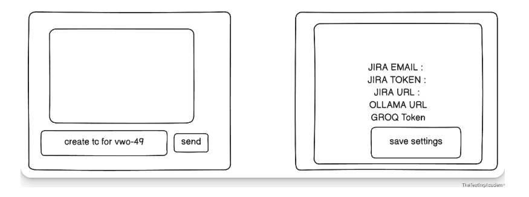

# Jira → Test Case Generator

A small Streamlit app that turns a Jira ticket into a Markdown test-case
table. You type a request such as `create tc for VWO-49`, the app fetches the
ticket from Jira, and a local LLM (Ollama) generates the test cases. If
Ollama is unreachable it automatically falls back to the Groq cloud API.



## Features

- **Chat-style input** — single text box, press **Send**.
- **Jira REST API v3** — fetches the issue by key using email + API token;
  parses Atlassian Document Format descriptions into plain text.
- **Ollama first, Groq fallback** — the UI shows which engine answered.
- **Settings panel** — Jira / Ollama / Groq values are entered once and saved
  to `config/settings.json`. A project `.env` file is also read and takes
  precedence. Nothing is hardcoded.
- **Markdown table output** with the exact columns
  `| Test ID | Description | Pre-conditions | Steps | Expected Result | Priority |`.

## Requirements

- Python 3.9+
- A Jira site + API token (Atlassian → Account → Security → API tokens)
- Ollama running locally with a Gemma model pulled (`ollama list`)
- (Optional) a Groq API key for the fallback

## Setup & run

```bash
cd chapter_03_Jira_TestCase
pip install -r requirements.txt

# Option 1 - enter credentials in the UI once (saved to config/settings.json)
streamlit run app.py

# Option 2 - provide a .env file (values override the UI-saved settings)
cp .env.example .env   # then fill in real values
streamlit run app.py
```

## Usage

1. Open the app in the browser (Streamlit prints the local URL).
2. In the right-hand **Configuration** panel, fill in:
   - Jira Email, Jira API Token, Jira Base URL (e.g. `https://my.atlassian.net`)
   - Ollama URL (`http://localhost:11434`) and the Ollama model name
   - Groq API key and model (only needed for the fallback)
3. Click **Save Settings**.
4. In the left panel type e.g. `create tc for VWO-49` (or just `VWO-49`) and
   click **Send**.
5. The generated test-case table appears below; an expander keeps history for
   the session.

## Architecture

```
app.py  (Streamlit UI: chat panel + settings panel)
  |--> config_manager.py   .env read + config/settings.json persistence
  |--> jira_client.py      Jira REST /rest/api/3/issue/{key} + ADF parsing
  `--> llm_handler.py      prompt builder -> Ollama /api/chat
                                    `--fallback--> Groq /chat/completions
```

- `config_manager.py` — settings precedence: defaults ← `settings.json` ← `.env`.
- `jira_client.py` — `JiraClient(email, token, base_url)`; raises
  user-presentable `JiraError`s on auth/404/network failures.
- `llm_handler.py` — `generate_test_cases(settings, ticket, num_cases)`
  returns `(provider, markdown)`. Tries Ollama, falls back to Groq on any
  failure, raises `LLMError` only when both fail.
- `app.py` — Streamlit single-screen, two-panel layout. No `pages/` folder
  is used; the configuration lives in the right-hand column.

## Notes / troubleshooting

- **Ollama not responding**: the app automatically tries Groq. To use Ollama
  only, ensure it is running (`ollama serve`) and the model name matches
  `ollama list` exactly.
- **Groq model deprecated**: model names change frequently. Open the Groq
  console model list and update **Groq Model** in Settings or `.env`
  (`GROQ_MODEL`).
- **Jira 401/403**: the token is an *API token*, not a password, and the
  email must be the account the token belongs to.
- **Wrong model in Settings**: fix it in the UI and click Save, or set the
  matching variable in `.env` (env wins).
- Secrets are never committed: `.env` and `config/settings.json` are
  gitignored.
